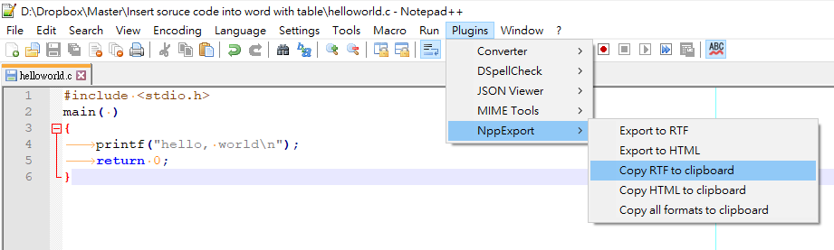

# insert source code into word

## USAGE  

### Step1 (in Notepad++)  
copy RTF file  
plugins -> NppExport -> copy RTF to Clibboard  
  
### Step2 (in Word)
Press alt + F8 and run Macro "aaa\_set\_table\_and\_insert\_code  

## RESULT  
  
